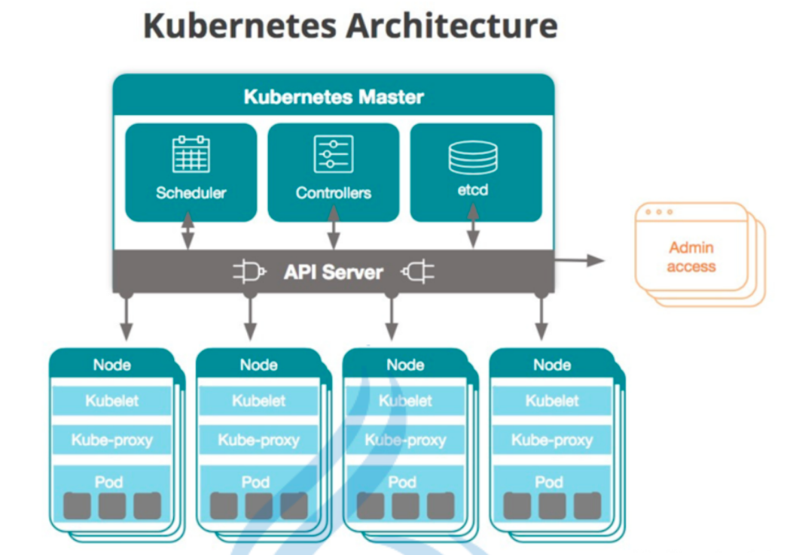
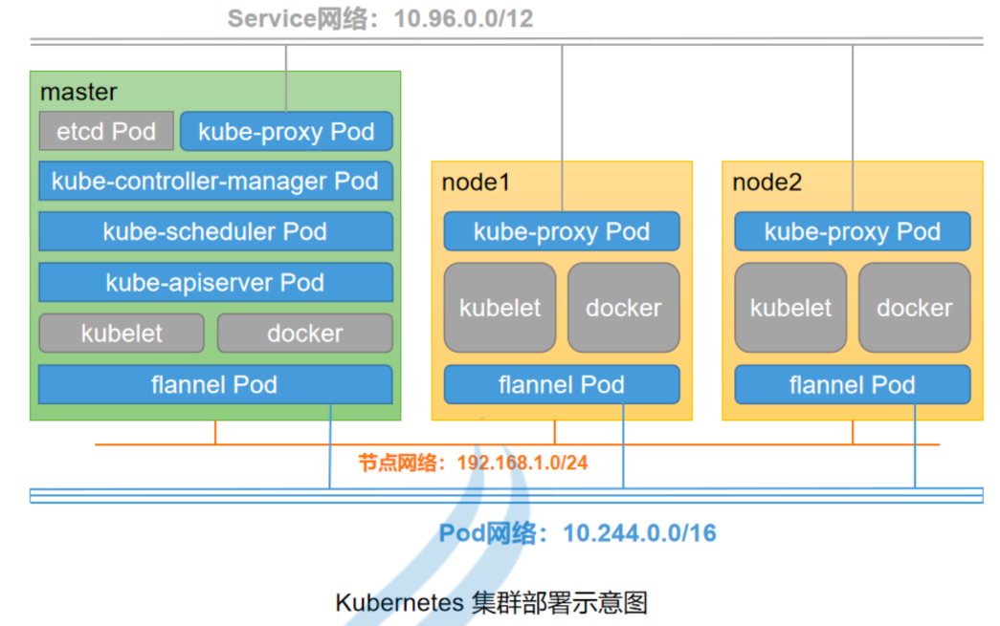

把 go 项目部署到 kubeneters
---

# 一、环境搭建
## （一）安装 docker

## （二）安装 kubeneters (K8S)


### 1. [在 macOS 系统上安装和设置 kubectl](https://kubernetes.io/zh/docs/tasks/tools/install-kubectl-macos/)
#### (1) 用 Homebrew 在 macOS 系统上安装

### 2. [安装 Minikube](https://minikube.sigs.k8s.io/docs/start/)
#### (1) 用 Homebrew 在 macOS 系统上安装
```
brew install minikube
```

# 二、把 go 项目部署到 kubeneters

## （一）编写 go 项目

httpserver 项目

### 1. 访问项目
```
curl http://127.0.0.1:8080/init
```

## （二）编写项目的 dockerfile

Dockerfile

## （三）构建 docker 镜像，并将 docker 镜像部署到 k8s 集群
> 推荐阅读：
> 
>  [Kubernetes 是什么](https://kubernetes.io/zh/docs/concepts/overview/what-is-kubernetes/)
>
>  [Kubernetes 组件](https://kubernetes.io/zh/docs/concepts/overview/components/)
>
>  [使用 Kubernetes 对象](https://kubernetes.io/zh/docs/concepts/overview/working-with-objects/)




### 1. 使用 Minikube k8s 集群环境
#### (1) [创建 Minikube 集群](https://kubernetes.io/zh/docs/tutorials/hello-minikube/)

```
# 启动minikube
$ minikube start

# 在浏览器中打开 Kubernetes 仪表板（Dashboard）
$ minikube dashboard

# 打开另外一个终端，并在此进程使用 minikube 内的 docker
$ eval $(minikube -p minikube docker-env)
```
> 注意：宿主机中的 docker 与  minikube 内的 dokcer 不共享镜像和容器

#### （2）创建项目镜像
1. 进入 httpserver 项目中（Dockerfile 同级）
2. 构建 docker 镜像
    ```
    # 在另外一个非minikube 内的 docker「 eval $(minikube -p minikube docker-env)」环境构建镜像
    docker build -t leeprince/go_k8s_httpserver .
    # 加载本地镜像到 minikube 内的 docker 中
    minikube image load leeprince/go_k8s_httpserver
    ```
> 加载本地镜像到 minikube 内的 docker 中是必须的，否则无法通过「--image-pull-policy=Never」拉去本地镜像

#### (3) 创建 Deployment/Pod
> 需要使用本地镜像（私有仓库）。参考：https://kubernetes.io/zh/docs/concepts/containers/images/#using-a-private-registry
> 
> 路径：使用私有仓库 > 提前拉取镜像
>
> 操作：提前拉取镜像，并且设置「--image-pull-policy=Never」

通过 Deployment 管理 pod 是官方推荐的做法。[参考：工作负载](https://kubernetes.io/zh/docs/concepts/workloads/)

> 帮助命令
```
kubectl --help
kubectl get --help
    kubectl get deployment
    kubectl get pods
    kubectl get events
    kubectl get services [service 名称]
kubectl run --help
kubectl create --help
```

##### a. 使用「kubectl create ...」创建 Deployment
> 格式：kubectl create deployment <deployment名称> --port=<暴露pod端口> --image=<镜像> [--replicas=<副本数>]
```
1. kubectl create deployment deployment-httpserver --port=8080 --image=leeprince/go_k8s_httpserver

2. 在minikube dashboard后跳转的仪表盘中将「imagePullPolicy: Always」修改为「imagePullPolicy: Never」并保存更新。稍等片刻后，deployment 和 pod 都正常启动。
```

> 注意
>   
>   1. 执行完毕后进入 minikube dashboard 修改 deployment 的配置. 因为如果直接运行minikube kubectl -- create deployment httpserver --port=8080 --image=leeprince/go_k8s_httpserver --image-pull-policy=Never 会提示没有--image-pull-policy这个选项


##### b. 通过使用「kubectl run ...」创建 Pod
> 如果创建 Deployment 则自动创建并管理 pod，此处操作只是为了测试.

- [x] 成功：使用私有镜像（本地）
```
kubectl run httpserver-pod --port=8080 --image-pull-policy=Never --image=leeprince/go_k8s_httpserver
```

- [ ] 失败：拉去镜像失败
    ```
    kubectl run pod-httpserver --port=8080 --image=leeprince/go_k8s_httpserver
    ```

###### （a）查看所有 pods
```
$ kubectl get pods
```
###### （b）进入 pod
> 格式：kubectl exec -it <pod名称> -- sh 
```

$ kubectl exec -it deployment-httpserver-5475674f94-thz5v -- bash
报错：OCI runtime exec failed: exec failed: container_linux.go:367: starting container process caused: exec: "bash": executable file not found in $PATH: unknown
   command terminated with exit code 126

需要使用：bash 替换成 sh
$ kubectl exec -it deployment-httpserver-5475674f94-thz5v -- sh 
```

###### （c）pod 内访问 httpserver 项目
因为基于 golang:alpine 环境构建的，所以没有 curl 命令，可以使用 wget 命令测试（下载输出结果）
```
curl http://127.0.0.1:8080/init

替换成：
wget http://127.0.0.1:8080/init
```

###### （d）pod 外访问 httpserver 项目
> 在pod 外部，目前是访问不了的
```
# pod 外部执行
$ curl http://127.0.0.1:8080/init
curl: (7) Failed to connect to 127.0.0.1 port 8080: Connection refused
```


#### (4) 创建 Service


> 参考：[MiniKube Deploy applications](https://minikube.sigs.k8s.io/docs/start/)

##### a. 通过 deployment + 「--type=NodePort」创建 service
> 格式：kubectl expose deployment <deployment名称> --port=<暴露到外网的端口> --target-port=<pod暴露的端口> --type=NodePort [--name=<该对象名称>]
>
> 更多：kubectl expose --help
>  
>       pod (po), service (svc), replicationcontroller (rc), deployment (deploy), replicaset (rs)
```
$ kubectl expose deployment deployment-httpserver --port=8081 --target-port=8080 --type=NodePort
service/deployment-httpserver exposed
```

##### b. 查看当前 service 
```
$ kubectl get services                                                                          
NAME                    TYPE        CLUSTER-IP    EXTERNAL-IP   PORT(S)          AGE
deployment-httpserver   NodePort    10.99.7.160   <none>        8081:30405/TCP   11s
kubernetes              ClusterIP   10.96.0.1     <none>        443/TCP          40d
```
> 说明：PORT(S) 8081:30405/TCP。
>
>   :8081 是在 node 中访问的主机。即 master 中也不能访问
>
>   :30405 是外网访问地址

##### c. 访问暴露的端口服务
```
$ ifconfig | grep inet
        inet 127.0.0.1 netmask 0xff000000 
        inet6 ::1 prefixlen 128 
        inet6 fe80::1%lo0 prefixlen 64 scopeid 0x1 
        inet6 fe80::aede:48ff:fe00:1122%en5 prefixlen 64 scopeid 0x4 
        inet 192.168.0.100 netmask 0xffffff00 broadcast 192.168.0.255
        inet6 fe80::9c86:b3ff:fe61:47f2%awdl0 prefixlen 64 scopeid 0xc 
        inet6 fe80::9c86:b3ff:fe61:47f2%llw0 prefixlen 64 scopeid 0xd 
        inet6 fe80::e954:e63c:c0ba:fd51%utun0 prefixlen 64 scopeid 0xe 
        inet6 fe80::1e45:9683:e7c0:15fc%utun1 prefixlen 64 scopeid 0xf 
        inet6 fe80::c022:effa:6cae:a174%utun2 prefixlen 64 scopeid 0x10 
        inet 192.168.64.1 netmask 0xffffff00 broadcast 192.168.64.255
        inet6 fe80::1c09:c467:2cd3:4a41%bridge100 prefixlen 64 secured scopeid 0x14 
```

###### （a）访问此服务的最简单方法是让 minikube 为您启动网络浏览器
```
$ minikube service deployment-httpserver
|-----------|-----------------------|-------------|---------------------------|
| NAMESPACE |         NAME          | TARGET PORT |            URL            |
|-----------|-----------------------|-------------|---------------------------|
| default   | deployment-httpserver |        8081 | http://192.168.64.2:30405 |
|-----------|-----------------------|-------------|---------------------------|
🎉  Opening service default/deployment-httpserver in default browser...

再修改访问路径：
http://192.168.64.2:30405/init
```

**或者，使用 kubectl 转发端口：**
> 格式：kubectl port-forward service/deployment-httpserver 18081:
>
> 更多：kubectl port-forward --help
>
>       kubectl port-forward service/<service名称>
>       kubectl port-forward pod/<pod名称>
```
$ kubectl port-forward service/deployment-httpserver 18081:8081
    Forwarding from 127.0.0.1:18081 -> 8080
    Forwarding from [::1]:18081 -> 8080

# 访问
# 回环ip
curl http://127.0.0.1:18081/init
```

```
$ kubectl port-forward --address 0.0.0.0 service/deployment-httpserver 18082:8081
    Forwarding from 127.0.0.1:18081 -> 8080
    Forwarding from [::1]:18081 -> 8080

# 访问
# 回环ip
curl http://127.0.0.1:18082/init

# 本机ip
curl http://192.168.0.100:18082/init
```

###### （b）以下访问都失败，因为这是使用 minikube 集群搭建的。需使用（a）的方式访问
```
# 回环ip
curl http://127.0.0.1:8081/init
curl http://127.0.0.1:30405/init

# k8s 集群ip
curl http://10.99.7.160:8081/init
curl http://10.99.7.160:30405/init

# 本机ip
curl http://192.168.0.100:8081/init
curl http://192.168.0.100:30405/init
```


#### (5) 负载均衡 deployments

##### a. 通过 deployment + 「--type=LoadBalancer 」 创建 service
> 参考：[Minikube LoadBalancer deployments](https://minikube.sigs.k8s.io/docs/start/)
```
$ kubectl expose deployment deployment-httpserver --port=8082 --target-port=8080 --type=LoadBalancer --name=type-loadbalancer-deployment-httpserver
service/type-loadbalancer-deployment-httpserver exposed 
```

##### b. 要查找可路由的 IP，请运行此命令并检查 EXTERNAL-IP 列：
```
$ kubectl get services
NAME                                      TYPE           CLUSTER-IP       EXTERNAL-IP   PORT(S)          AGE
deployment-httpserver                     NodePort       10.99.7.160      <none>        8081:30405/TCP   96m
kubernetes                                ClusterIP      10.96.0.1        <none>        443/TCP          40d
type-loadbalancer-deployment-httpserver   LoadBalancer   10.108.181.118   <pending>     8082:31380/TCP   3m33s
```

##### c. 在另一个窗口中，启动隧道为 “type-loadbalancer-deployment-httpserver” deployment 创建一个可路由的 IP
```
$ minikube tunnel
Status: 
        machine: minikube
        pid: 56655
        route: 10.96.0.0/12 -> 192.168.64.2
        minikube: Running
        services: [type-loadbalancer-deployment-httpserver]
    errors: 
                minikube: no errors
                router: no errors
                loadbalancer emulator: no errors


```


##### d. 要查找可路由的 IP，请运行此命令并检查 EXTERNAL-IP 列：
```
$ kubectl get services
NAME                                      TYPE           CLUSTER-IP       EXTERNAL-IP      PORT(S)          AGE
deployment-httpserver                     NodePort       10.99.7.160      <none>           8081:30405/TCP   103m
kubernetes                                ClusterIP      10.96.0.1        <none>           443/TCP          40d
type-loadbalancer-deployment-httpserver   LoadBalancer   10.108.181.118   10.108.181.118   8082:31380/TCP   10m
```

##### e. 访问 httpserver 服务
```
# EXTERNAL-IP 访问
curl http://10.108.181.118:8082/init
# 集群外部ip 访问
curl http://192.168.64.2:31380/init
```

### 2. 使用 [kubeadm](https://kubernetes.io/zh/docs/setup/production-environment/tools/kubeadm/install-kubeadm/) 工具来 创建和管理 Kubernetes 集群

适用于生产环境，待完善...


